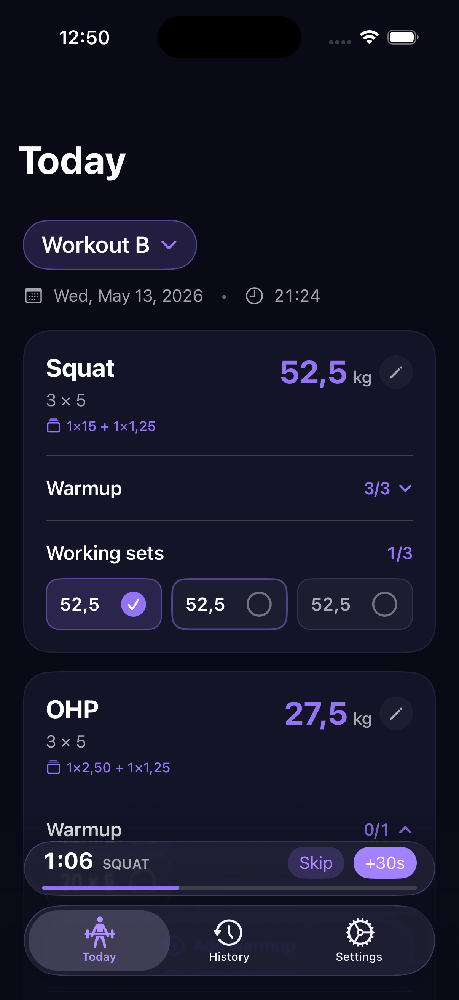

# Lift

A small iOS workout tracker I built for myself. It's opinionated around how I like to train, so the defaults aren't meant to suit everyone — but the source is here in case any of it is useful.

<p align="center">
  
</p>

## How I train

- Two alternating workouts (A/B), squatting every session.
- The same weight across all working sets — typically 3×5, 1×5 for deadlift.
- Linear progression: when every working set hits the target reps, the weight goes up by the next loadable jump on the bar; otherwise it stalls and I try again next time.
- Warmups are computed from the working weight and the plates I have, not entered by hand.

The app reflects all of that: pre-seeded with squat/bench/row/OHP/deadlift, a plate-aware calculator, automatic warmup ramps, and a rest timer that fires a notification when the set is over.

## Running it

Requires Xcode 16.4+ and an iOS 18 simulator or device. The Xcode project is generated with [XcodeGen](https://github.com/yonaskolb/XcodeGen) from `project.yml`.

```sh
brew install xcodegen
xcodegen generate
open Lift.xcodeproj
```

Then build and run the `Lift` scheme. On first launch a short wizard asks for the bar weight, plate inventory, and starting weights; after that the seeded program is ready to use.

## Stack

SwiftUI + SwiftData, Swift 6 with strict concurrency, iOS 18 deployment target. Tests live in `LiftTests` and run via the `Lift` scheme.
